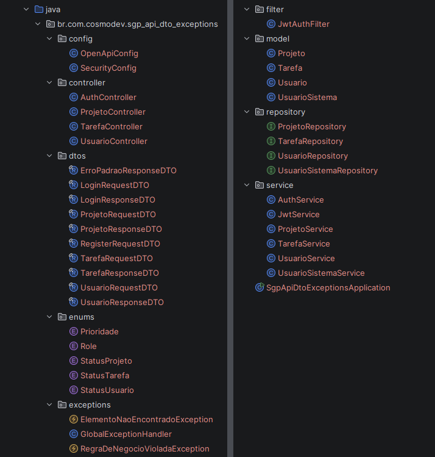
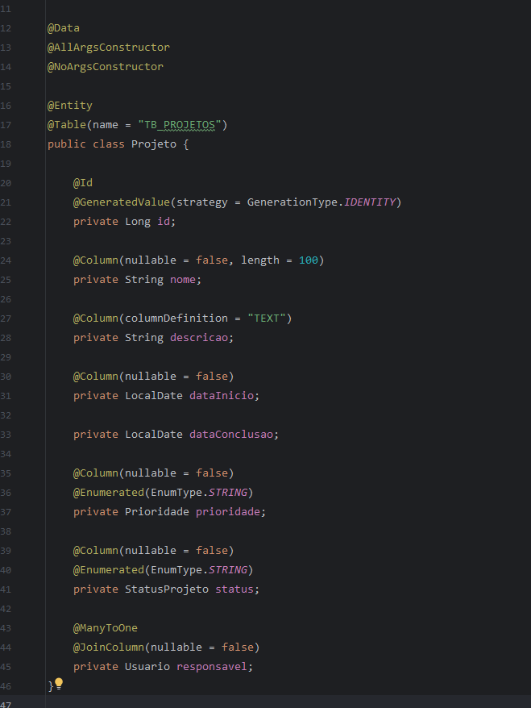
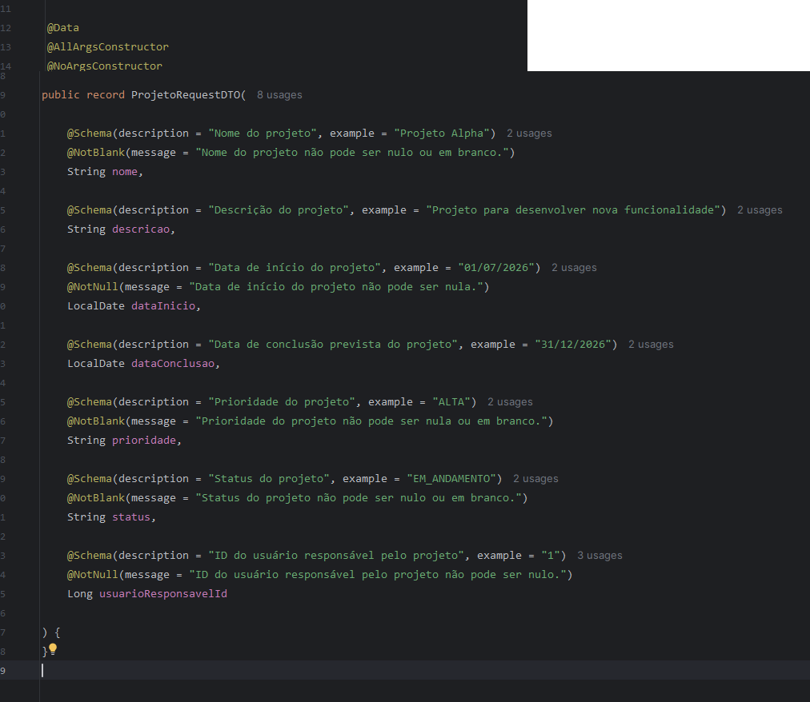
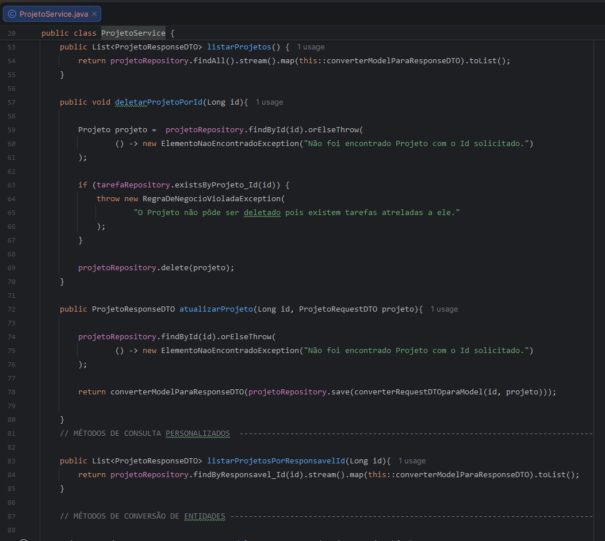
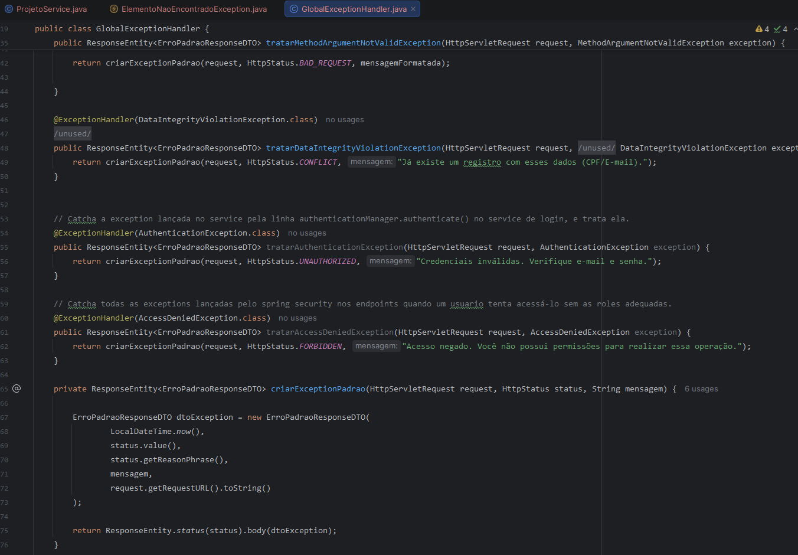
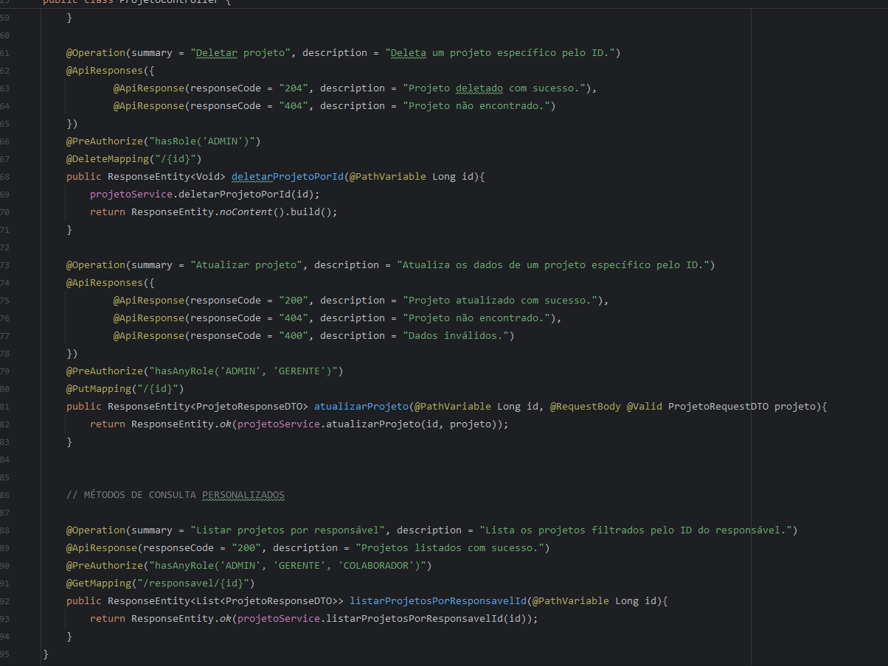
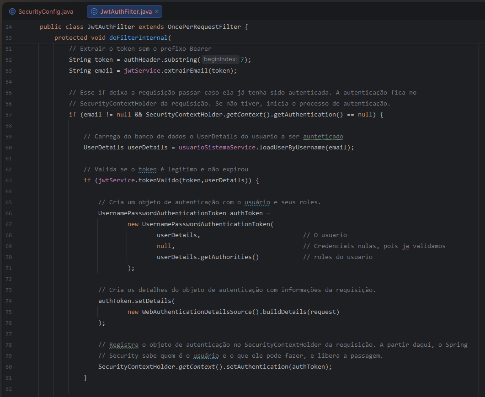

# SGP API - Sistema de gestão de projetos

API REST desenvolvida em **JAVA + Spring Boot** para gerenciamento completo de projetos e colaboradores: Criação de projetos, cadastro de usuários, vinculação de usuários a projetos, etc.

> Projeto pessoal desenvolvido do zero, com foco em boas práticas de arquitetura backend.

---

## 🚀 Tecnologias

| Categoria | Tecnologia |
|---|---|
| Linguagem | Java 21 (LTS) |
| Framework | Spring Boot 4.1.1 |
| Persistência | Spring Data JPA + Hibernate |
| Banco de dados | MySQL |
| Validação | Bean Validation (Jakarta Validation) |
| Redução de boilerplate | Lombok |
| Build | Maven |
| Documentação de API | Swagger / OpenAPI |
| Segurança | Spring Security + JWT |

---

## 🔭 Objetivos do projeto

### Este projeto foi construído com intenção de treinar boas práticas de desenvolvimento e conceitos técnicos de cada stack do projeto, no fim entregando um sistema funcional:

- **Separação em camadas**: `Model` → `Repository` → `Service` → `Controller`
- **Implementação de DTO's de response/request dedicados para cada entidade**
- **Spring Security com tokens JWT implementado de maneira correta**: Proteção de todos os endpoints do sistema.
- **Tratamento de exeções**: Tratamento personalizado de exceções com globalexceptionhandler.
- **Validação com Jakarta Validation**
- **Documentação com Swagger**

---

## 📸 Demonstrações da codificação

### 📂 Estrutura de diretórios

### ⚪ Camada model

### ⚪ DTO's

### ⚪ Camada service

### ⚪ ExceptionHandler

### ⚪ Camada controller

### ⚪ Implementação do authfilter

---

## 🗺️ Status do projeto

O projeto se encontra **concluído**, testado com auxílio da ferramenta Insominia, e aprovado, atingindo todos os objetivos estipulados no princípio.

### 📚 Sobre o versionamento

Não houve versionamento de código durante o desenvolvimento do projeto. Esse repositório recebeu o upload do projeto já concluído desde o dia 01/09/2026.

---

## 👤 Sobre o desenvolvedor

Desenvolvido por **Arthur Cosmo**, desenvolvedor com base sólida em **Java e Orientação a Objetos** (encapsulamento, herança, polimorfismo, interfaces) e APIs REST com Spring Boot, atualmente aprofundando conhecimento em **Testes automatizados e aperfeiçoamento de APIs REST**.

Este projeto reflete um processo de aprendizado ativo e documentado, utilizando conhecimentos adquiridos em meus estudos sobre desenvolvimento de software. Não é um projeto copiado de tutoriais.

📍 Recife, PE — em busca de oportunidade como desenvolvedor júnior.

